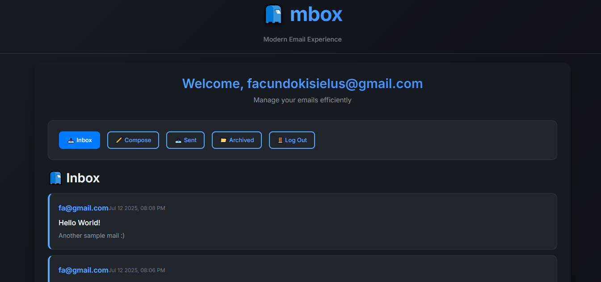
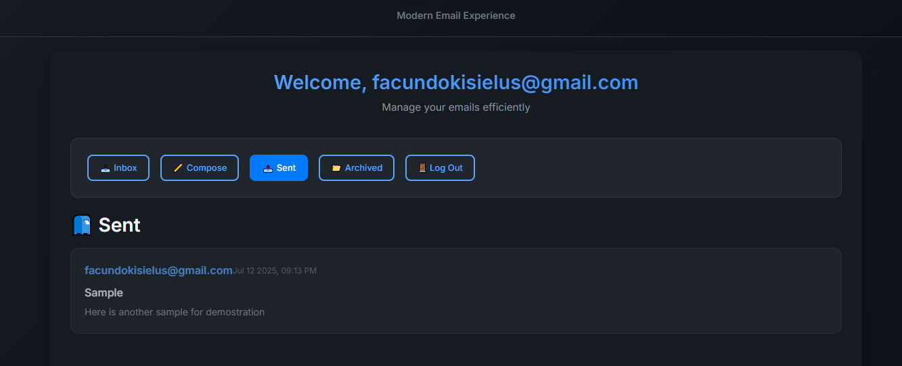

# 📮 mbox - Modern Email Experience

A beautiful, dark-themed email client built with Django and JavaScript. This project showcases modern web development practices with a focus on user experience and visual design.


## 🌟 Features

### ✨ Modern Dark UI
- **Beautiful dark theme** with carefully crafted color palette
- **Smooth animations** and hover effects
- **Responsive design** that works on all devices
- **Professional typography** using Inter font
- **GitHub-inspired** design language

### 📧 Email Functionality
- **Send emails** with rich composition interface
- **View inbox, sent, and archived** emails
- **Archive/Unarchive** email management
- **Reply to emails** with quoted original content
- **Real-time email updates** with loading states
- **Mark emails as read/unread** automatically

### 🎨 User Experience
- **Intuitive navigation** with active state indicators
- **Error handling** with beautiful notification system
- **Loading animations** for better user feedback
- **Professional authentication** pages
- **Branded experience** with mbox logo and identity

## 🛠️ Technology Stack

- **Backend**: Django 5.2.3
- **Frontend**: Vanilla JavaScript (ES6+)
- **Styling**: Custom CSS with CSS Variables
- **Database**: SQLite
- **Authentication**: Django's built-in auth system
- **API**: Django REST Framework patterns

## 📱 Screenshots


*Browse your inbox*


*See the emails you've sent*

### Login Page
Beautiful, clean authentication with mbox branding

### Inbox Interface  
Modern email list with read/unread indicators and hover effects

### Email Composition
Rich compose interface with proper form validation

### Email View
Clean email reading experience with reply and archive actions

## 🚀 Getting Started

### Prerequisites
- Python 3.8 or higher
- Django 5.2.3
- Modern web browser

### Installation

1. **Clone the repository**
   ```bash
   git clone https://github.com/yourusername/mbox.git
   cd mbox
   ```

2. **Install dependencies**
   ```bash
   pip install django==5.2.3
   ```

3. **Run migrations**
   ```bash
   python manage.py makemigrations mail
   python manage.py migrate
   ```

4. **Create superuser (optional)**
   ```bash
   python manage.py createsuperuser
   ```

5. **Start development server**
   ```bash
   python manage.py runserver
   ```

6. **Visit the application**
   Open your browser to `http://127.0.0.1:8000`

## 📁 Project Structure

```
mbox/
├── mail/                   # Main application
│   ├── models.py          # User and Email models
│   ├── views.py           # API endpoints and views
│   ├── urls.py            # URL routing
│   ├── static/mail/       # Static files
│   │   ├── styles.css     # Dark theme CSS
│   │   └── inbox.js       # Frontend JavaScript
│   └── templates/mail/    # HTML templates
│       ├── layout.html    # Base template with mbox branding
│       ├── inbox.html     # Main email interface
│       ├── login.html     # Authentication pages
│       └── register.html
├── project3/              # Django project settings
├── db.sqlite3            # Database file
└── manage.py             # Django management script
```

## 🎯 Key Features Implemented

### Backend (Django)
- **Custom User Model** extending AbstractUser
- **Email Model** with sender, recipients, subject, body, timestamps
- **RESTful API endpoints** for email operations
- **Authentication system** with login/register/logout
- **Email serialization** for JSON API responses

### Frontend (JavaScript)
- **Single Page Application** behavior
- **Dynamic email loading** and display
- **Form validation** and error handling
- **Real-time UI updates** without page refresh
- **Email composition** with reply functionality
- **Archive management** with proper state updates

### Design System
- **CSS Variables** for consistent theming
- **Component-based styling** approach
- **Responsive grid layouts**
- **Smooth animations** and transitions
- **Professional color palette**
- **Typography hierarchy**

## 🎨 Design Philosophy

This project focuses on creating a **modern, professional email experience** that rivals commercial email clients. Key design principles:

- **Dark-first design** reduces eye strain
- **Minimal, clean interface** focuses on content
- **Consistent spacing** and typography
- **Intuitive navigation** with clear visual hierarchy
- **Smooth interactions** enhance user experience

## 🔧 Development Features

### Code Quality
- **Modular JavaScript** with clear function separation
- **CSS organization** with logical grouping
- **Error handling** throughout the application
- **Responsive design** patterns
- **Accessibility considerations**

### Performance
- **Efficient API calls** with proper error handling
- **Smooth animations** with hardware acceleration
- **Optimized loading states** for better UX
- **Minimal JavaScript bundle** with vanilla JS


## 👨‍💻 Author

**Facundo Kisielus**
- LinkedIn: [facundo-kisielus](https://www.linkedin.com/in/facundo-kisielus-39819a228/)
- GitHub: [@facukis](https://github.com/facukis)

## 🙏 Acknowledgments

- **CS50's Web Programming with Python and JavaScript** course for the project foundation
- **GitHub** for the dark theme inspiration
- **Inter font** by Rasmus Andersson
- **Modern CSS** techniques and best practices

---
